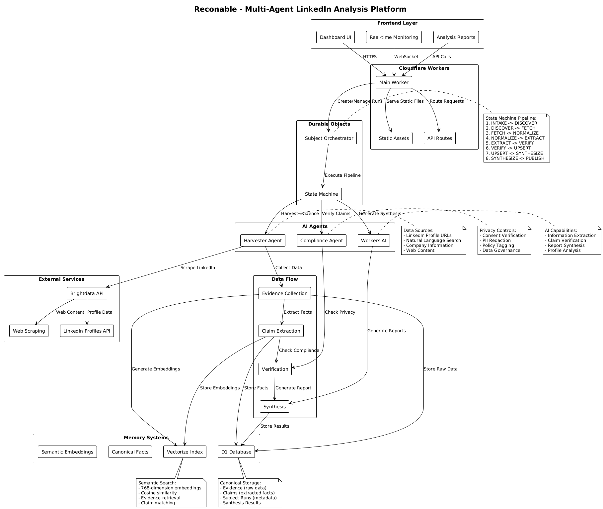

# Reconable 🔍

> **AI-Powered LinkedIn Profile Analysis Platform**  
> A stateful, memory-first multi-agent system built on Cloudflare's infrastructure that performs comprehensive LinkedIn profile analysis using web scraping and AI.

[](https://workers.cloudflare.com/)
[](https://www.typescriptlang.org/)
[](https://brightdata.com/)

## 🎯 Overview

Reconable is a sophisticated LinkedIn profile analysis tool that demonstrates the power of **Cloudflare's Agent Development Kit (ADK)** combined with **Durable Objects**, **Workers AI**, and **Brightdata's web scraping API**. It performs deep analysis of LinkedIn profiles to provide actionable insights about professional presence, engagement metrics, and profile optimization opportunities.

### Key Features

✨ **Multi-Agent Architecture**
- **Orchestrator Agent**: Manages the analysis pipeline with a state machine
- **Harvester Agent**: Collects data from LinkedIn via Brightdata API
- **Compliance Agent**: Ensures data privacy and verification

🧠 **AI-Powered Analysis**
- Profile completeness scoring
- Keyword optimization analysis
- Engagement metrics assessment
- Profile section quality evaluation
- 5 actionable recommendations per profile

💾 **Distributed Memory System**
- **D1 Database**: Canonical facts and evidence storage
- **Vectorize**: Semantic embeddings for similarity search
- **Durable Objects**: Stateful orchestration and resumability

🎨 **Real-Time Dashboard**
- Live agent activity monitoring
- Tool call visualization
- Progress tracking with state machine
- Comprehensive final analysis report

## 🏗️ Architecture

### System Overview

The following PlantUML diagram shows the complete architecture of Reconable



### Architecture Components

**Frontend Layer**
- **Dashboard UI**: Real-time monitoring interface
- **Analysis Reports**: Comprehensive LinkedIn profile analysis
- **Real-time Monitoring**: Live agent activity visualization

**Cloudflare Workers**
- **Main Worker**: Entry point and request routing
- **API Routes**: RESTful endpoints for analysis management
- **Static Assets**: Frontend files and resources

**Durable Objects**
- **Subject Orchestrator**: Stateful pipeline management
- **State Machine**: 8-stage analysis pipeline execution

**AI Agents**
- **Harvester Agent**: Data collection from multiple sources
- **Compliance Agent**: Privacy verification and PII protection
- **Workers AI**: Llama 3.1 70B for extraction, verification, and synthesis

**Memory Systems**
- **D1 Database**: Canonical storage for evidence, claims, and metadata
- **Vectorize Index**: 768-dimension embeddings for semantic search

**External Services**
- **Brightdata API**: LinkedIn profile scraping and web content collection
- **LinkedIn Profiles API**: Structured data extraction

### Data Flow Pipeline

1. **Evidence Collection**: Harvester Agent collects data from Brightdata
2. **Claim Extraction**: Workers AI extracts structured facts from evidence
3. **Verification**: Compliance Agent validates claims against privacy policies
4. **Synthesis**: Workers AI generates comprehensive analysis reports
5. **Storage**: Results stored in D1 and Vectorize for future retrieval

> **Note**: The complete PlantUML source is available in [`architecture.puml`](architecture.puml) for editing and customization.

## 🚀 Quick Start

### Prerequisites

- [Cloudflare Account](https://dash.cloudflare.com/sign-up) (Free tier works!)
- [Wrangler CLI](https://developers.cloudflare.com/workers/wrangler/install-and-update/) installed
- [Brightdata Account](https://brightdata.com/) with LinkedIn Profiles API access
- Node.js 18+ and npm

### Installation

1. **Clone the repository**
   ```bash
   git clone <your-repo-url>
   cd agents-starter
   ```

2. **Install dependencies**
   ```bash
   npm install
   ```

3. **Configure Brightdata**
   - Sign up at [Brightdata](https://brightdata.com/)
   - Subscribe to [LinkedIn Profiles API](https://brightdata.com/products/datasets/linkedin-profiles)
   - Get your API token and Dataset ID from the dashboard

4. **Run the automated setup script**
   ```bash
   chmod +x setup.sh
   ./setup.sh
   ```

   The setup script will:
   - ✅ Create D1 database (`reconable-db`)
   - ✅ Initialize database schema (evidence, claims, runs tables)
   - ✅ Create Vectorize index (`reconable-embeddings`)
   - ✅ Set Brightdata API token as a secret
   - ✅ Configure `wrangler.jsonc`
   - ✅ Deploy to Cloudflare Workers

5. **Access your application**
   ```
   https://reconable.<your-subdomain>.workers.dev
   ```

### Manual Setup (Alternative)

If the automated script doesn't work, follow these steps:

```bash
# 1. Create D1 Database
wrangler d1 create reconable-db

# 2. Update wrangler.jsonc with the database ID from step 1

# 3. Initialize database schema
wrangler d1 execute reconable-db --file=./schema.sql

# 4. Create Vectorize index
wrangler vectorize create reconable-embeddings \
  --dimensions=768 \
  --metric=cosine

# 5. Set Brightdata secrets
wrangler secret put BRIGHTDATA_API_TOKEN
# Paste your Brightdata API token when prompted

# 6. Update BRIGHTDATA_DATASET_ID in wrangler.jsonc
# Set it to your LinkedIn Profiles API dataset ID (usually starts with "gd_")

# 7. Deploy
wrangler deploy
```

## 📖 Usage

### Web Interface

1. Navigate to your deployed Worker URL
2. Enter a **LinkedIn profile URL** or a **person's name**
3. Click "Start Analysis"
4. Watch the real-time agent activity in the dashboard
5. View the comprehensive analysis report when complete

### Input Types

**LinkedIn Profile URL** (1 API call):
```
https://www.linkedin.com/in/username/
```

**Natural Language Search** (up to 5 API calls):
```
John Smith software engineer
```

### API Endpoints

**Start Analysis**
```bash
POST /api/run
Content-Type: application/json

{
  "subjectName": "https://www.linkedin.com/in/username/",
  "inputType": "linkedin",
  "maxApiCalls": 1
}
```

**Check Status**
```bash
GET /api/run/{runId}/status
```

**Get Report**
```bash
GET /api/run/{runId}/report
```

## 🧪 Development

### Local Development

```bash
# Install dependencies
npm install

# Run locally with Miniflare
npm run dev

# Open http://localhost:8787
```

### Testing

```bash
# Run tests
npm test

# Run tests in watch mode
npm run test:watch
```

### Deployment

```bash
# Deploy to production
wrangler deploy

# Tail logs
wrangler tail

# View Durable Object instances
wrangler d1 list
```

## 🔧 Configuration

### Environment Variables

Configure in `wrangler.jsonc`:

```jsonc
{
  "vars": {
    "BRIGHTDATA_DATASET_ID": "gd_xxxxx" // Your LinkedIn Profiles API dataset ID
  }
}
```

### Secrets

Set using Wrangler CLI:

```bash
# Brightdata API Token
wrangler secret put BRIGHTDATA_API_TOKEN
```

### Bindings

- **D1 Database**: `reconable-db` - Stores evidence, claims, and run metadata
- **Vectorize Index**: `reconable-embeddings` - 768-dimension embeddings for semantic search
- **Durable Object**: `SubjectOrchestrator` - Stateful pipeline orchestration
- **Workers AI**: Llama 3.1 70B for synthesis and analysis
- **Browser Rendering**: (Optional) For additional web scraping

## 📊 Analysis Output

Each analysis provides:

### Executive Summary
- Professional overview
- Current position and company
- Location and key achievements
- Network size and influence assessment

### Key Roles & Timeline
- Current and past positions
- Educational background
- Professional milestones

### LinkedIn Profile Analysis
- **Completeness Score** (0-100%)
- **Profile Strength** (Strong/Good/Moderate/Weak)
- **Keyword Optimization** with suggestions
- **Engagement Metrics** (followers, connections, traction rating)
- **Section-by-Section Quality** assessment
- **5 Actionable Recommendations**

## 🔒 Privacy & Compliance

- ✅ **Public Data Only**: Scrapes publicly visible LinkedIn profiles
- ✅ **No Authentication Required**: No LinkedIn login needed
- ✅ **Compliance Agent**: Verifies all data before storage
- ✅ **GDPR Aware**: Respects data privacy regulations
- ✅ **Rate Limited**: Brightdata API handles rate limiting

## 🛠️ Tech Stack

| Component | Technology |
|-----------|-----------|
| Runtime | Cloudflare Workers |
| Language | TypeScript |
| Orchestration | Durable Objects |
| Database | Cloudflare D1 (SQLite) |
| Vector Storage | Cloudflare Vectorize |
| AI/LLM | Workers AI (Llama 3.1 70B) |
| Web Scraping | Brightdata LinkedIn Profiles API |
| Frontend | Vanilla HTML/CSS/JS |
| Build Tool | Wrangler |

## 📁 Project Structure

```
agents-starter/
├── src/
│   ├── agents/
│   │   ├── orchestrator.ts      # Main state machine & pipeline
│   │   ├── harvester.ts         # Data collection agent
│   │   └── compliance.ts        # Privacy & verification agent
│   ├── memory/
│   │   ├── canonical.ts         # D1 database operations
│   │   ├── vector.ts            # Vectorize embeddings
│   │   └── schema.ts            # TypeScript interfaces
│   ├── scraping/
│   │   └── brightdata-scraper.ts # Brightdata API integration
│   ├── prompts/
│   │   ├── extraction.ts        # AI extraction prompts
│   │   ├── verification.ts      # Compliance prompts
│   │   └── synthesis.ts         # Report generation prompts
│   ├── routes.ts                # API route handlers
│   └── server.ts                # Main Worker entrypoint
├── public/
│   └── index.html               # Dashboard UI
├── schema.sql                   # D1 database schema
├── wrangler.jsonc              # Cloudflare configuration
├── setup.sh                    # Automated setup script
└── README.md                   # This file
```

## 🐛 Troubleshooting

### Common Issues

**"No such model" error**
- The Workers AI model name has changed. Current model: `@cf/meta/llama-3.1-70b-instruct`

**"Failed to generate embedding: 405"**
- This is non-critical. Evidence is still stored in D1 and analysis will work.

**Brightdata timeout**
- Increase polling timeout (currently 15 minutes)
- Check Brightdata dashboard for job status

**Empty analysis report**
- Check logs: `wrangler tail`
- Verify evidence was stored in D1
- Check Brightdata API token and dataset ID

### Debugging

```bash
# View real-time logs
wrangler tail --format pretty

# Check D1 data
wrangler d1 execute reconable-db --command "SELECT * FROM evidence LIMIT 5"

# List Durable Object instances
wrangler d1 list
```

## 📚 Additional Resources

- [Cloudflare Workers Docs](https://developers.cloudflare.com/workers/)
- [Durable Objects Guide](https://developers.cloudflare.com/durable-objects/)
- [Workers AI Documentation](https://developers.cloudflare.com/workers-ai/)
- [Brightdata API Docs](https://docs.brightdata.com/)
- [Vectorize Documentation](https://developers.cloudflare.com/vectorize/)

## 🤝 Contributing

Contributions are welcome! Please feel free to submit a Pull Request.

## 📄 License

This project is licensed under the MIT License - see the [LICENSE](LICENSE) file for details.

## 🙏 Acknowledgments

- Built with [Cloudflare Workers](https://workers.cloudflare.com/)
- Powered by [Brightdata](https://brightdata.com/) web scraping
- AI by [Workers AI](https://developers.cloudflare.com/workers-ai/)

---

**Note**: This is a demonstration project showcasing Cloudflare's Agent Development Kit and distributed systems capabilities. Use responsibly and respect LinkedIn's terms of service and data privacy regulations.
